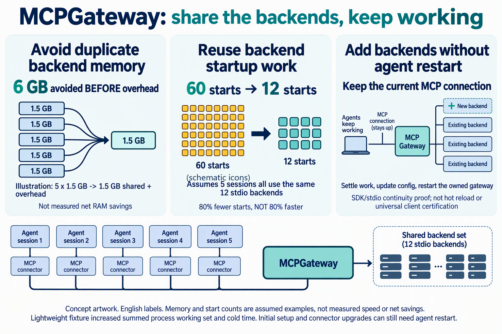

# MCPGateway — Partagez des serveurs MCP locaux entre sessions d'agents de programmation

<a id="languages"></a>
<details>
<summary>Languages / 语言 / 言語 / اللغات (16)</summary>

[English](../../README.md) · [简体中文](README.zh-CN.md) · [繁體中文](README.zh-TW.md) · [日本語](README.ja.md) · [한국어](README.ko.md) · [Español](README.es.md) · [Français](README.fr.md) · [Deutsch](README.de.md) · [Português (Brasil)](README.pt-BR.md) · [Italiano](README.it.md) · [Русский](README.ru.md) · [العربية](README.ar.md) · [हिन्दी](README.hi.md) · [Bahasa Indonesia](README.id.md) · [Türkçe](README.tr.md) · [Tiếng Việt](README.vi.md)

</details>

Partagez les backends MCP locaux entre sessions : évitez la RAM dupliquée, réutilisez le travail de démarrage et ajoutez seulement de la configuration sans redémarrer la connexion MCP actuelle de l’agent (parcours SDK/stdio ; gain net selon le surcoût).

[Démarrer via Copilot CLI](#first-use) · [Vérification des clients](../CLIENTS.md#compatibility-summary) · [Preuves](#resource-examples)



Concept avec libellés anglais, ni capture ni benchmark.

- **Évitez la mémoire des backends dupliqués:** Illustration : 5 × 1.5 GB → un ensemble ; 6 GB de duplication évitée **avant** le surcoût de la passerelle et des connecteurs, pas une économie mesurée.
- **Réutilisez le travail de démarrage répété:** Si les 5 sessions utilisent les 12 services stdio : 60 → 12 démarrages de backend, pas un démarrage 80% plus rapide.
- **Ajoutez seulement la configuration ; gardez la connexion de l’agent:** SDK/stdio : 1 initialisation survit au redémarrage de votre passerelle après la fin des travaux ; le connecteur reste actif, sans rechargement automatique ni UI native de conversation vérifiée. Enregistrement initial ou mise à niveau du runtime peuvent exiger un redémarrage client. [SDK/stdio](../BENCHMARK.md#configuration-only-connection-continuity)

Adapté à plusieurs sessions utilisant les mêmes backends et catalogue ; une session ou des backends légers peuvent ne pas amortir le surcoût.

<a id="first-use"></a>
## Première configuration et premier appel

**Prérequis :** Node.js 24 ou ultérieur, npm, Git, Copilot CLI avec plugins et services MCP déjà configurés et authentifiés. L'installation initiale passe actuellement par Copilot CLI ; Windows est la principale plateforme testée et Agency est facultatif. La compatibilité et le niveau de vérification diffèrent selon les clients.

Configurations et sauvegardes peuvent contenir des identifiants : gardez-les privés et n’approuvez que les changements prévus.

[Sortie et runtime persistant](../REFERENCE.md#planned-exit) · [rollback ≠ daemon shutdown](../REFERENCE.md#setup-recovery)

```powershell
copilot plugin marketplace add yeelam-gordon/MCPGateway
copilot plugin install shared-mcp-gateway@mcp-gateway
```

1. Après l'installation du plugin, lancez Copilot CLI et invoquez `/mcp-gateway-setup`. Examinez l'aperçu avant d'approuver les changements souhaités. Fermez puis rouvrez Copilot et exécutez le `readinessCommand` exact fourni. Conservez les commandes de sauvegarde et de restauration. Installer le plugin seul ne fusionne pas les configurations.

La découverte et le schéma ne nécessitent pas de réservation ; si `requiresExclusiveAccess: true`, utilisez `claim_server` avant `call_tool`.

> Utilisez la passerelle pour [ma lecture autorisée] : listez les serveurs, trouvez l’outil et examinez son schéma ; préparez des arguments avec des valeurs de test autorisées et non sensibles. Obtenez les approbations normales, réservez avant une exécution exclusive et libérez après tous les appels. Montrez le résultat réel. Ne réessayez pas un résultat inconnu : transmettez au responsable de l’installation.

[SDK tool flow: `list_servers` → `search_tools` → `get_tool_schema` → `claim_server` (exclusive) → `call_tool` → `release_server`](../../README.md#first-use) · [REFERENCE](../REFERENCE.md#unknown-exclusive-result)

2. Appelez `list_servers` avec `{}` : les alias, états et indicateurs d'exclusivité des services existants doivent apparaître. Choisissez un backend autorisé, recherchez un terme de votre tâche avec `search_tools`, puis obtenez le schéma de l'outil avec `get_tool_schema`. Construisez les arguments selon ce schéma et effectuez une lecture approuvée avec `call_tool`. Vérifiez l'enregistrement attendu ou un résultat vide documenté ; une réponse de la passerelle ne suffit pas à prouver la réussite de la lecture.
3. Si `requiresExclusiveAccess: true`, utilisez `claim_server` avant l’appel et `release_server` une fois tous les appels terminés. Les backends non exclusifs n'ont pas besoin de réservation. En cas de délai dépassé avec un résultat inconnu, ne réessayez pas : examinez le travail actif et coordonnez le redémarrage. Si le résultat est inconnu, le backend exclusif reste bloqué jusqu’au redémarrage de la passerelle ; libérer la réservation ou déconnecter le client ne permet pas de le débloquer en toute sécurité, et une déconnexion n’annule pas l’opération.
4. Dans une deuxième session utilisant le même connecteur et catalogue, répétez `list_servers` / `search_tools` pour le même alias. Attendez `ready` pour le backend initialisé et les capacités du même catalogue. Un alias identique ne prouve ni l’identité du processus ni une économie de RAM ; consultez le test public de réutilisation. [Méthode de réutilisation des processus](../BENCHMARK.md#method) · [Test du cache du catalogue](../../test/catalog-scale.test.js)

Si le catalogue est vide, vérifiez la configuration choisie et l’aperçu de migration. Sans correspondance, utilisez un terme plus précis des descriptions d’outils du backend lui-même ; aucun nom d’outil n’est universel. En cas d’erreur d’authentification ou de disponibilité, suivez l’[authentification](../REFERENCE.md#native-http-oauth) et la [restauration/retour arrière](../REFERENCE.md#setup-recovery), sans répéter les appels ni lancer un processus parallèle pour contourner la passerelle.

[Exemple complet en anglais](../../README.md#first-use) · [Compatibilité et limites](../CLIENTS.md#compatibility-summary)

## Limites, confidentialité et restauration

Trouver ce dépôt depuis Claude Code, Codex, Gemini CLI, Kimi ou Qwen CLI ne garantit pas une intégration native. Aucun parcours d'installation de Gemini CLI n'est documenté ici ; Antigravity est un autre client. Kimi n'a été testé qu'au niveau de l'adaptateur. Les configurations et sauvegardes peuvent contenir des identifiants : ne les publiez pas. Les backends peuvent contacter des services distants ; le partage ne signifie pas un fonctionnement hors ligne ni des économies fixes de RAM ou de jetons.

Avant de cesser l’utilisation, terminez les workflows actifs et attendez la fin des appels. Restaurer la configuration du client n’arrête pas le runtime persistant. Suivez la [procédure de sortie et de remise à l’opérateur (anglais)](../REFERENCE.md#planned-exit) et vérifiez l’état final ; conservez les données privées et les identifiants, sans arrêter de processus sans rapport.

[Confidentialité](../REFERENCE.md#state-and-privacy) · [Restauration et retour arrière](../REFERENCE.md#setup-recovery)

<a id="resource-examples"></a>

**Évitez la RAM des backends dupliqués**

Hypothèse illustrative, pas un benchmark : 5 sessions ont chacune besoin des mêmes 12 connexions ; un ensemble complet de backends utilise 1.5 GB. Les sessions compatibles partagent les processus réels via le même connecteur et catalogue.

| Déploiement | RAM des backends |
|---|---|
| Copies indépendantes | 5 × 1.5 GB = 7.5 GB |
| Ensemble partagé | 1.5 GB + surcoût de la passerelle et des connecteurs |

RAM dupliquée évitée avant surcoût : 7.5 GB - 1.5 GB = 6 GB. L’économie totale reste inconnue sans mesure. 1.5 GB n’est pas une constante selon les charges ou clients ; il ne s’agit pas de la RAM de cinq modèles.

**Réutilisez aussi le travail de démarrage.** Si les 5 sessions utilisent les 12 services stdio, les copies exigent jusqu’à `5 × 12 = 60` démarrages contre `12` partagés : `60 - 12 = 48` doublons évités, soit `48 / 60 × 100 = 80%` de démarrages en moins. La connexion à la demande ne connecte que les `k` backends utilisés ; les autres ne démarrent pas. C’est un nombre d’opérations, pas un démarrage 80% plus rapide. La latence n’est pas mesurée ; concurrence, authentification et plateforme influent sur la durée.

1000 outils → 6 définitions initiales : (1000 - 6) / 1000 × 100 = 99.4% de définitions en moins, pas de tokens. Les schémas demandés ensuite ont un coût ; les clients différant déjà leur chargement peuvent moins en bénéficier. Le test de catalogue synthétique vérifie six outils et un cache partagé par deux clients, pas les performances RSS. [catalog-scale.test.js](../../test/catalog-scale.test.js)

**Fixture léger mesuré : hausse du working set cumulé des processus** Médianes de 3 essais, Windows x64 / Node 24.13.1 : schéma + echo partagé 426.2 ms avec backend froid, 21.1 ms au deuxième client, 19.0 ms au cinquième. Total premier client : 503.5 ms direct, 894.3 ms partagé avec passerelle prête ; partagé entièrement à froid 1886.7 ms. Processus backend 5 → 1, mais processus totaux 5 → 7 et working set cumulé 357.0 MiB → 564.0 MiB : working set cumulé des processus plus élevé ; mémoire physique unique non mesurée. Un seul echo ne représente pas des services lourds réels ; 1.5 GB ci-dessus est une autre hypothèse, pas une mesure. [BENCHMARK.md](../BENCHMARK.md)

La mesure porte sur le working set cumulé des processus ; ni la mémoire physique sans double comptage ni les octets privés (private bytes) n’ont été mesurés.

<a id="mechanism"></a>
<a id="réutilisez-les-backends-et-découvrez-les-outils-à-la-demande"></a>

## Fonctionnement

Ajoutez des backends sans redémarrer la connexion MCP actuelle de l’agent : synchronisez les ajouts, terminez les travaux actifs et redémarrez seulement votre passerelle ; le connecteur actuel se reconnecte. [SDK/stdio](../BENCHMARK.md#configuration-only-connection-continuity)

Le test SDK/stdio conserve le même connecteur et la même connexion MCP pour découvrir un nouvel alias et exécuter echo après redémarrage ; les interfaces de conversation des produits ne sont pas testées. Pas de rechargement automatique ; conflits à examiner. Enregistrement initial ou mise à niveau du runtime peuvent nécessiter un redémarrage client. Les appels interrompus ne sont pas rejoués ; réservez de nouveau l’accès exclusif après redémarrage.

Ce n'est pas une plateforme de gouvernance des API d'entreprise.

La passerelle présente toujours 6 outils à l'agent : 4 pour découvrir et appeler des fonctions, et 2 pour les intégrations nécessitant un workflow exclusif. L'ajout de connexions n'agrandit pas cette interface initiale ; le schéma complet n'est chargé que pour l'outil choisi. Les connexions déjà configurées et authentifiées sont réutilisées, sans installer de services ni fournir d'identifiants.

```text
Agent A ─┐                           ┌─ Intégration A: plusieurs outils
Agent B ─┼─ connecteur ─ MCPGateway ─┼─ Intégration B: plusieurs outils
Agent C ─┘                           └─ Intégration C: plusieurs outils
```

Plusieurs agents accèdent à MCPGateway par le même connecteur, qui se connecte à la demande aux backends configurés sélectionnés. Ce schéma illustre le partage : ce n’est ni un benchmark ni une vérification en fonctionnement, et il ne signifie pas que tous les backends démarrent.

<a id="clients"></a>
## Installation et mise à niveau par client

> Ceci est une présentation localisée. Le [README](../../README.md) anglais et le guide client anglais lié ci-dessous restent les références pour l'installation complète, les mises à niveau et les détails techniques.

<details>
<summary>Installation et mise à niveau par client</summary>

Un même catalogue MCP peut servir plusieurs agents. Par exemple, partez de **10** connexions dans Copilot et migrez explicitement une configuration Claude prise en charge contenant **2** nouvelles connexions : les deux agents pourront utiliser les mêmes **12**.

- L’installation du plugin seule ne fusionne pas les configurations. Les entrées de même nom ne sont dédupliquées que si leurs définitions d’alias sont identiques ; pointer vers le même service ne suffit pas. Les conflits arrêtent le processus pour examen.
- La migration commence par un aperçu, crée une sauvegarde et refuse les réglages natifs non pris en charge.
- Cela ne signifie pas que tous les clients natifs ont été testés de bout en bout. Consultez le [guide de migration (anglais)](../CLIENTS.md#cross-client-migration).

| Client | Installation | Mise à niveau  Initialisation obligatoire | Niveau de vérification |
|---|---|------|---|
| GitHub Copilot CLI | [Installer](../CLIENTS.md#copilot-cli-install) | [Mettre à niveau](../CLIENTS.md#copilot-cli-upgrade)  [Copilot CLI](../CLIENTS.md#shared-gateway-prerequisite) | [Parcours marketplace/installation ; analyse isolée](../CLIENTS.md#compatibility-summary) |
| VS Code (éditeur) | [Installer](../CLIENTS.md#vs-code-install) | [Mettre à niveau](../CLIENTS.md#vs-code-upgrade)  [Copilot CLI](../CLIENTS.md#shared-gateway-prerequisite) | [Adaptateur de format/enregistrement testé ; pas de session native de bout en bout](../CLIENTS.md#compatibility-summary) |
| Claude Code | [Installer](../CLIENTS.md#claude-code-install) | [Mettre à niveau](../CLIENTS.md#claude-code-upgrade)  [Copilot CLI](../CLIENTS.md#shared-gateway-prerequisite) | [Configuration isolée analysée ; aucun modèle/backend](../CLIENTS.md#compatibility-summary) |
| Codex CLI | [Installer](../CLIENTS.md#codex-install) | [Mettre à niveau](../CLIENTS.md#codex-upgrade)  [Copilot CLI](../CLIENTS.md#shared-gateway-prerequisite) | [Validation native bloquée par une politique](../CLIENTS.md#compatibility-summary) |
| OpenCode | [Installer](../CLIENTS.md#opencode-install) | [Mettre à niveau](../CLIENTS.md#opencode-upgrade)  [Copilot CLI](../CLIENTS.md#shared-gateway-prerequisite) | [Adaptateur de format/enregistrement testé ; pas de session native de bout en bout](../CLIENTS.md#compatibility-summary) |
| Qwen Code | [Installer](../CLIENTS.md#qwen-code-install) | [Mettre à niveau](../CLIENTS.md#qwen-code-upgrade)  [Copilot CLI](../CLIENTS.md#shared-gateway-prerequisite) | [Adaptateur de format/enregistrement testé ; pas de session native de bout en bout](../CLIENTS.md#compatibility-summary) |
| Kimi CLI | [Installer](../CLIENTS.md#kimi-cli-install) | [Mettre à niveau](../CLIENTS.md#kimi-cli-upgrade)  [Copilot CLI](../CLIENTS.md#shared-gateway-prerequisite) | [Adaptateur de format/enregistrement testé ; pas de session native de bout en bout](../CLIENTS.md#compatibility-summary) |
| Antigravity CLI | [Installer](../CLIENTS.md#antigravity-cli-install) | [Mettre à niveau](../CLIENTS.md#antigravity-cli-upgrade)  [Copilot CLI](../CLIENTS.md#shared-gateway-prerequisite) | [Adaptateur de format/enregistrement testé ; pas de session native de bout en bout](../CLIENTS.md#compatibility-summary) |

</details>

**Référence opérationnelle (anglais) :** [Consulter la référence opérationnelle](../REFERENCE.md)

**Licence :** [MIT](../../LICENSE)
